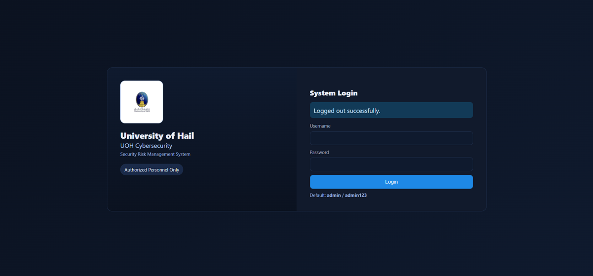
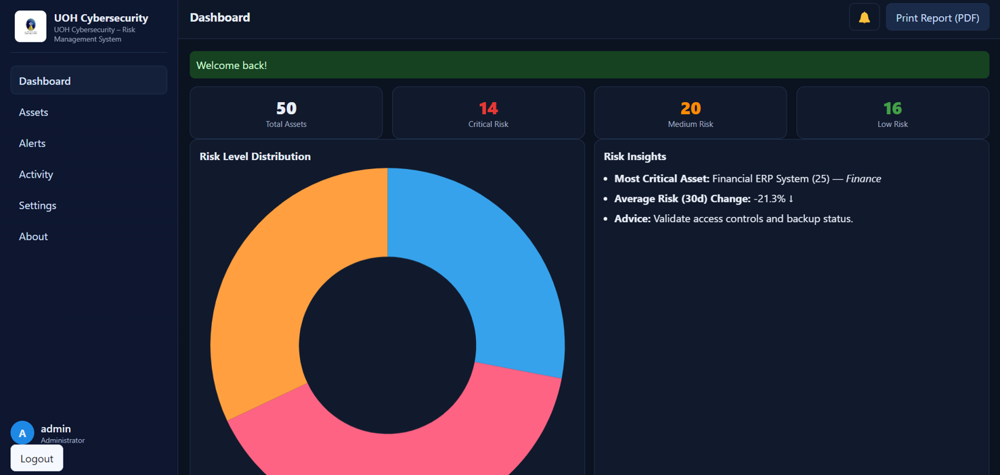
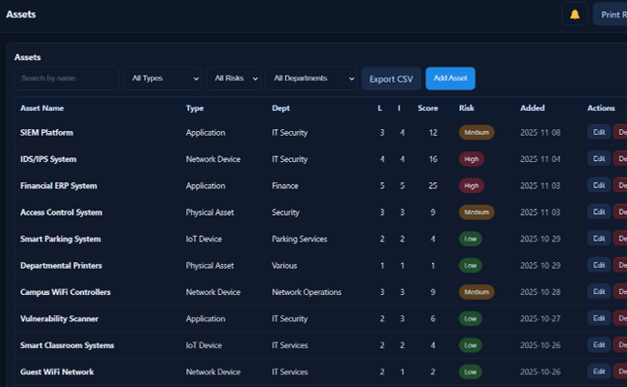
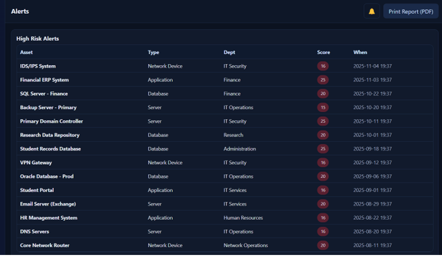
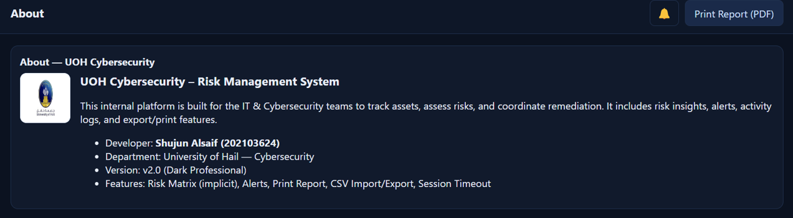
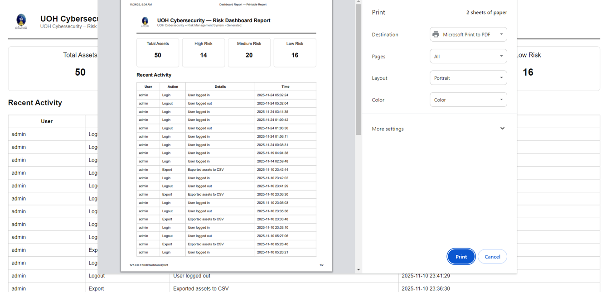

# 🛡️ Security Risk Management System

A web-based cybersecurity risk management system developed using Flask to help organizations manage IT assets, assess security risks, monitor activities, and generate reports.

---

## 📌 Project Overview

This project provides a centralized platform for managing organizational assets and evaluating their security risks. It enables administrators to monitor high-risk assets, review activity logs, export data, and generate printable reports through a modern dashboard.

---

## ✨ Features

- 🔐 User Authentication
- 📊 Interactive Dashboard
- 🖥️ Asset Management (CRUD)
- 🚨 High-Priority Risk Alerts
- 📈 Risk Distribution Charts
- 📝 Activity Logging
- 📄 Printable PDF Reports
- 📤 CSV Export
- ⏱️ Session Timeout
- 🌙 Professional Dark UI

---

## 🛠️ Technologies Used

- Python
- Flask
- SQLite
- HTML5
- CSS3
- JavaScript
- Chart.js

---

## 🚀 Getting Started

### Clone the repository

```bash
git clone https://github.com/shjoonfahad/Security-Risk-Management-System.git
```

### Install dependencies

```bash
pip install flask
```

### Run the project

```bash
python app.py
```

---

## 🖼️ Screenshots

### Login



### Dashboard



### Assets



### Alerts



### About



### Printable Report



---

## 💡 Future Improvements

- Role-Based Access Control (RBAC)
- Email Notifications
- REST API
- Advanced Risk Analytics
- Multi-user Collaboration
- Security Tool Integration

---

## 👩‍💻 Author

**Shujun Alsaif**

Information Security Graduate

University of Hail

- 💼 LinkedIn: https://www.linkedin.com/in/shujun-alsaif
- 💻 GitHub: https://github.com/shjoonfahad
